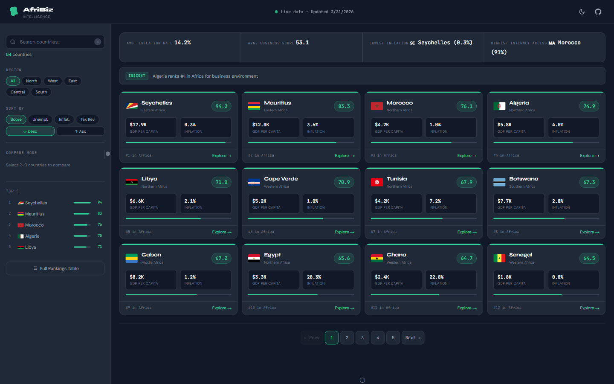

# AfriBiz Intelligence

Welcome to AfriBiz Intelligence is a simple dashboard that helps you understand business conditions across all 54 African countries.

This tool is useful because it turns complex World Bank data into something easy to read and compare. Instead of going through long reports, you can quickly see which countries are growing, where business conditions are improving, and where risks might exist.

For entrepreneurs, it helps you decide where to invest or expand.
For students, it makes research faster and clearer.
For anyone interested in Africa's economy, it gives a quick and reliable way to understand what is really happening across different countries.

By putting all this data in one place, the dashboard saves time, reduces confusion, and helps you make better, data-driven decisions.

---

## Snapshot


---

## Try it Out!
You can access the live app through our load balancer:
- **Main Link:** [https://afribiz-intelligence.gania.tech](https://afribiz-intelligence.gania.tech)

Or directly through the servers:
- [http://52.70.87.10/](http://52.70.87.10/)
- [http://3.93.218.74/](http://3.93.218.74/)

---

## What can it do?
- **Live Data:** It fetches the latest info for all 54 African countries in real-time.
- **Business Scores:** I created an algorithm that gives each country a score from 0 to 100 based on things like GDP, inflation, and internet access.
- **Easy Filtering:** You can filter by region (like North or West Africa) and sort by what matters to you (best score, lowest inflation, etc.).
- **Country Details:** Click on any country to see more details, including capital city, population, and even some business news!
- **Works Offline:** If you've visited before, the app saves the data so it still works even if you lose your internet connection.
- **Dark Mode:** It looks great in both light and dark themes!

---

## How I Built It
I wanted to keep this project simple and fast, so I didn't use any fancy frameworks like React or Vue. It's built with:
- **HTML5 & CSS3:** For the structure and beautiful design.
- **Vanilla JavaScript:** For all the logic and fetching data.
- **World Bank API:** This is where all the economic data comes from. — [Documentation](https://datahelpdesk.worldbank.org/knowledgebase/topics/125589)
- **REST Countries API:** Used for flags and basic country info. — [Documentation](https://restcountries.com)
- **GNews API:** To show the latest business headlines. — [Documentation](https://gnews.io/docs) | Key: `4fccb62daf321b4ad5855fde84e13a73`

---

## Running it on Your Computer
You don't need to install anything! Just follow these steps:

1. **Clone this project:**
   ```bash
   git clone https://github.com/Gania-Isaro/afribiz-intelligence.git
   cd afribiz-intelligence
   ```
2. **Open the app:**
   - Just double-click `index.html` in your file explorer.
   - Or, if you have Python, run: `python3 -m http.server 8080` and go to `localhost:8080`.

---

## How I Deployed It (The Technical Stuff)
To make sure the app is always online and fast, I set up a professional web infrastructure:

1. **Web Servers:** I used two Ubuntu servers (Web01 and Web02) running **Nginx** to host the files.
2. **Load Balancer:** I set up a third server (Lb01) running **HAProxy**. Its job is to split the traffic between the two web servers so neither one gets too busy.
3. **Redundancy:** If one web server goes down, the load balancer automatically sends everyone to the other one. Cool, right?

---

## What I Learned
Working on this project was a huge learning experience for me. I learned:
- How to fetch and handle data from multiple APIs at once.
- How to build a custom "scoring" system to rank countries.
- The importance of **caching** (saving data locally) to make apps faster and work offline.
- How to set up and configure **Nginx** and **HAProxy** on Linux servers.
- How to keep code clean and organized without using big frameworks.

---

## Project Info
- **School:** African Leadership University (ALU)
- **Course:** Web Infrastructure
- **Year:** 2025
- **Author:** Gania Isaro

---

## License
This project is licensed under the MIT License - feel free to use it for your own learning!
